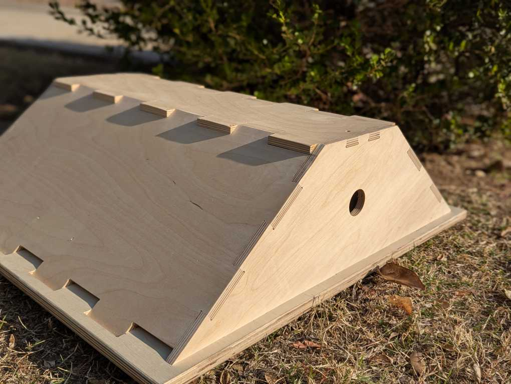
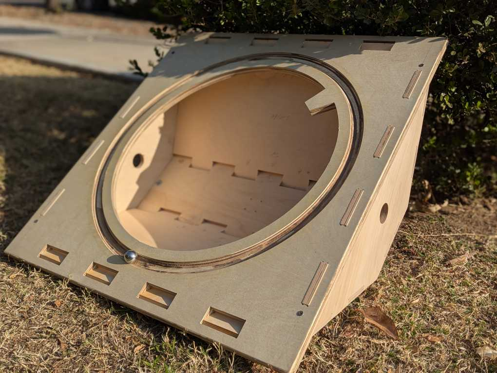

# Finger Joint Generator

Quick Look: Python script which generates DXF files to cut the shape of a finger joint

## Desired Capability

- Generate dxf polylines of finger joints that are fully parametric

- Generate dxf polylines of holes which mate with fingers, these are also fully parametric

- Control the shape of "dogbones" in the cut fingers and holes

- Control the number of fingers per span

## How to Use

1. Generate an "Edge class" with the following parameters
   
   - numFingers (int): The number of fingers within the span
   
   - fingerLength (float): The length of the finger, a negative number can be used to generate a finger in the opposite direction
   
   - clearance (float): How much to inset the finger width to allow for mechanical clearance
   
   - span (float): The length of which the fingers will be generated
   
   - extra (float or list): A single value which is added to each end of the span or a list of two values which are added to the appropriate end of the span. This value can be positive or negative.

2. From here, the fingers and/or mating holes can be generated using the following functions. Discussion of the input parameters can be found in the next section.

   - genFingerPoints: A list of XY points are stored in "self.cordsFinger". These points do not contain dogbones.

   - genFingerPointsBone: A list of XYB points are stored in "self.cordsFinger". These points do contain dogbones.

   - genHoleBone: A list of XYB points are stored in "self.cordsHoles". These points do contain dogbones.

3. The generated points can now be shifted and/or rotated using the function "self.rotateShiftElement" with the following input parameters.

   - element (string): using either "finger" or "hole", specify which coordinates need translation

   - shiftOrigin (list): a list of x and y coordinates to which the fingers will be translated

   - angle (float): angle in degrees which the fingers will be rotated, this can be positive or negative

4. Multiple edges can be joined together using numpy's concatenate or other python tools

   - Note: The last point of one edgeA may be the first point of "edgeB", it would be good practice to omit the last point of "edgeA" prior to joining the points.
  
  ```
  np.concatenate([edgeA.cordsFinger[:-1], edgeB.cordsFinger")
  ```

5. After storing the points in a dictionary, said dictionary is passed to "dxfFromDict" which plots the lists as [LWPolylines](https://ezdxf.readthedocs.io/en/stable/dxfentities/lwpolyline.html) within layers as specified by the key of the dictionary.

6. See "dxfTest.py" and "trapezoidBox.py" as examples of how to use the functions

## Functions

**self.genFingerPointsBone**

*Input variables:*

- dogBoneDia (float): Diameter of the dogbone

- dogBoneType ("H", "X", "I"): Three options to generate dogbones, each one places the dogbone differently on internal corners. Useful if cutting the forms on a CNC

- invertBone (bool): Change if the dogbone is generated on the "top" or "bottom" of the finger. Useful when generating a mating finger edge.

- drillNum (int): Generates a 2D list of drill locations. The int specifies how many drill locations per finger. Useful for mounting together edges.

*Output Variables:*

- self.cordsFinger (2D list): A list of XYB coordinates which are used by [LWPolylines](https://ezdxf.readthedocs.io/en/stable/dxfentities/lwpolyline.html) to plot out the finger's shape

- self.cordsDrill (2D list): A list of XY coordinates which specify the drill locations on a finger. If a finger/hole and drill points coordinates are generated and then translated using "self.rotateShiftElement", both the drill points and finger/hole coordinates are translated

**self.genHoleBone**

*Input Variables:*

- materialThick (float): vertical distance of the hole

- clearence (float): How much the hole is increased, both the vertical and horizontal distance

- dogBoneDia (float): Diameter of the dogbone

- dogBoneType ("H", "X", "I"): Three options to generate dogbones, each one places the dogbone differently on internal corners. Useful if cutting the forms on a CNC

- openEnds (bool): If the holes are to be generated reach the edges of a material, the first and last hole can be open to allow for that

- invertHoles (bool): Generates the "inverse" holes. The "other" mating geometry

- drillNum (int): Generates a 2D list of drill locations. The int specifies how many drill locations per space between holes. Useful for mounting together edges.

*Output Variables:*

- self.cordsHoles(3D list): The first list dimension is for each hole generated. The second list dimension is list of XYB coordinates which are used by [LWPolylines](https://ezdxf.readthedocs.io/en/stable/dxfentities/lwpolyline.html) to plot out the hole's shape.

- self.cordsDrill (2D list): A list of XY coordinates which specify the drill locations on a finger. If a finger/hole and drill points coordinates are generated and then translated using "self.rotateShiftElement", both the drill points and finger/hole coordinates are translated

**dxfFromDict**

*Input Variables:*

- pointDict(dictionary): Each dictionary key (str) becomes the layer name which the points will be plotted onto. Each coordinate corresponds to a XY paring and a bulge value. Below are some examples:
  
  ```
  pointDict["rectangle"] = [[0, 0, 0], [1, 0, 0], [1, 1, 0], [1, 0, 0], [0, 0, 0]]
  
  pointDict["Ls"] = [[[0, 0, 0], [0, 1, 0], [1, 1, 0]], [[1, 0, 0], [2, 0, 0], [2, 1, 0]]]
  ```

- fileName(str): Specify the filename and/or path of the dxf file to be generated, file extension must be stated

- drillDict(dictionary): Each dictionary key (str) become the layer name which the points we points will be plotted onto. Each coordinate corresponds to a XY paring and the radius of the drill. Below is an example:
  
  ```
  drillDict ["drillPoints] = [[0, 0, 0.2], [1, 0, 0.2], [2, 0, 0.4]]
  ```

- units(int): As specified by the [ezdxf documentation](https://ezdxf.readthedocs.io/en/stable/concepts/units.html#module-ezdxf.units), the dxf units can be specified. I have defaulted to mm. All coordinate generation is unit-less.

## Example Build

The DXF files generated from "trapezoidBox.py" were utilized to cut out the following display stand which was utilized to show the [Luggable PC](https://github.com/martinbros/Luggable-PC) at Open Sauce 2024. Incorporated into the bottom of the stand is a 0.75in bearing race so that the display could spin in place. 




